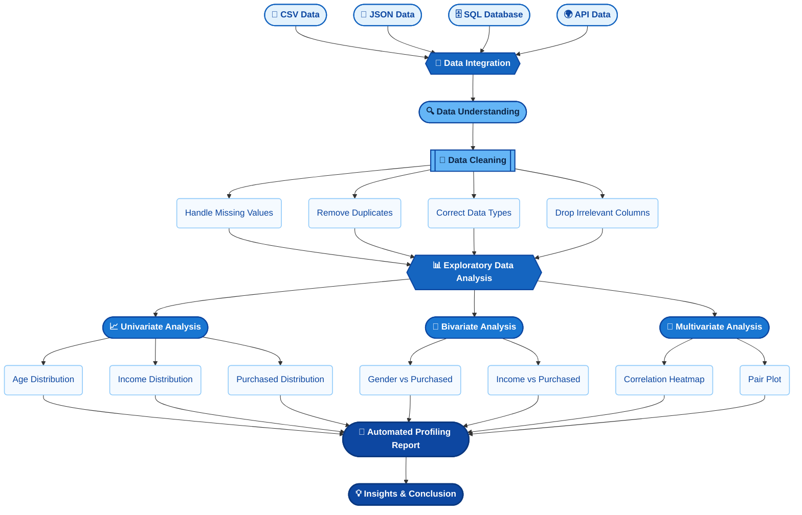

This project presents a **Data Acquisition + Cleaning + EDA + Automated Profiling** analysis on a real-world customer dataset containing **100 unique records**. The objective is to pull the same customer data from three different source formats (CSV, JSON, SQL), merge them into one dataset, clean and deduplicate it, and identify which features — if any — drive the `Purchased` outcome.

The project combines multi-source data engineering with practical implementation in Python (Jupyter Notebook), covering the complete analytical workflow — from format-specific loading pitfalls and deduplication to statistical EDA and automated profiling.


---

## 🎯 Objective

Merge customer data from CSV, JSON, SQL, and a live API into a single clean dataset, and identify which features (if any) drive the `Purchased` outcome.

---
## 🛠️ Tools & Libraries


---

## 🎬 Project Demo

[](https://drive.google.com/file/d/15rVC3j1UWCeM1BUH4yeZeG4bfqLHGLoZ/view?usp=sharing)

📹 Click the badge above to watch the complete project demonstration.

## 🗂️ Project Files

| File | Description |
|------|-------------|
| 📓 `Data_Profiler.ipynb` | Complete data acquisition, cleaning, EDA & profiling notebook |
| 📊 `customers.csv` | Customer dataset — 100 records, 7 columns (tab-separated) |
| 🧾 `customers.json` | Same 100 records in JSON format |
| 🗄️ `customers.db` | SQLite database built in-notebook from the CSV |
| 📄 `data_profiling_report.html` | Auto-generated `ydata-profiling` report |
| 📘 `README.md` | Project documentation (this file) 


---


## 🏗️ Project Architecture

```
Raw Data (CSV + JSON + SQL + API)
     │
     ▼
┌─────────────────────────────────────────────────────────┐
│  PART B — DATA ACQUISITION                                │
│  CSV (sep fix) → JSON → SQLite → DummyJSON API → merged_df│
└─────────────────────────────────────────────────────────┘
     │
     ▼
┌─────────────────────────────────────────────────────────┐
│  PART C — CLEANING                                         │
│  Missing values → dtype check → duplicate removal          │
│  300 rows → 100 unique rows                                │
└─────────────────────────────────────────────────────────┘
     │
     ▼
┌─────────────────────────────────────────────────────────┐
│  PART D — EXPLORATORY DATA ANALYSIS                        │
│  Univariate → Bivariate → Multivariate → Correlations      │
└─────────────────────────────────────────────────────────┘
     │
     ▼
┌─────────────────────────────────────────────────────────┐
│  PART E — DATA PROFILING                                   │
│  Automated report → data_profiling_report.html             │
└─────────────────────────────────────────────────────────┘
```

## 📊 Dataset

| Property | Value |
|----------|-------|
| Primary sources | `customers.csv`, `customers.json`, `customers.db` |
| Unique customers | 100 |
| Columns | 7 — `CustomerID`, `Name`, `Age`, `Gender`, `City`, `Income`, `Purchased` |
| Rows after merge (before cleaning) | 300 (same 100 customers × 3 sources) |
| Rows after dedup | 100 |
| Target concept | `Purchased` (Yes / No) |

### Other Sources Merged In
- **`customers.json`** — same 100 customer records in structured key-value format
- **`customers.db`** — SQLite database, built in-notebook from the CSV data, queried via `SELECT * FROM Customers`
- **DummyJSON API** (`https://dummyjson.com/users`) — used to demonstrate live, nested API ingestion


## 🗺️ Project Roadmap




---
## 📂 Dataset Overview

```python
import pandas as pd

csv_data = pd.read_csv("customers.csv", sep="\t")
print(csv_data.head())
print(csv_data.shape)
csv_data.info()
```

Columns: `CustomerID`, `Name`, `Age`, `Gender`, `City`, `Income`, `Purchased`

✅ **Shape:** 100 customers × 7 columns — no missing values, once the tab separator is fixed.

## 📥 Step 1 — Load Each Source Independently

**CSV**
```python
csv_data = pd.read_csv("customers.csv")
print(csv_data.shape)   # (100, 1) ❌
```
💡 **Insight:** `.info()` showed a single collapsed column instead of 7 — the file is actually **tab-separated**, not comma-separated. Fixed with `sep="\t"`, after which the shape correctly reads `(100, 7)`.

**JSON**
```python
json_data = pd.read_json("customers.json")
json_data.info()
```
💡 **Insight:** Parsed cleanly on the first try — 100 rows × 7 columns, correct dtypes, zero missing values. JSON's key-value structure avoided the column-boundary issue the CSV had.

**SQL**
```python
import sqlite3

conn = sqlite3.connect("customers.db")
csv_data.to_sql("Customers", conn, if_exists="replace", index=False)
sql_data = pd.read_sql("SELECT * FROM Customers", conn)
```
💡 **Insight:** The corrected CSV data was written into a SQLite table `Customers` and read back successfully — a full write → read roundtrip with zero data loss.

**API**
```python
import requests

response = requests.get("https://dummyjson.com/users")
df_api = pd.DataFrame(response.json()["users"])
print(df_api.shape)
```
💡 **Insight:** 100+ live dummy user records pulled in, including nested fields (address, bank, company, university) — a realistic example of semi-structured API data that would need `pd.json_normalize()` before merging in a production pipeline.

## 🔗 Step 2 — Merge & Deduplicate

```python
merged_df = pd.concat([csv_data, json_data, sql_data], ignore_index=True)
print(merged_df.shape)                        # (300, 7)
print(merged_df.isnull().sum())                # 0 everywhere
print("Duplicates:", merged_df.duplicated().sum())   # 200
```
💡 **Insight:** All three sources represent the **same 100 customers**, so merging triples every record — 300 rows, of which 200 are exact duplicates. Zero missing values, `Age` ranges 18–60 (avg ≈ 39.3), `Income` ranges ₹19,000–₹119,000 (avg ≈ ₹72,470).

```python
merged_df.fillna(0, inplace=True)                     # safeguard, no real NaNs
merged_df["Age"] = merged_df["Age"].astype(int)        # dtype verification
merged_df["Income"] = merged_df["Income"].astype(int)
merged_df = merged_df.drop(columns=["UnnecessaryColumn"], errors="ignore")
merged_df.drop_duplicates(inplace=True)
print(merged_df.shape)                                 # (100, 7)
```
💡 **Insight:** No genuine missing-value or dtype cleanup was needed — both were precautionary checks. The one cleaning step that actually mattered was `drop_duplicates()`, which took the dataset from 300 rows down to the true **100 unique customers**.

## 📊 Step 3 — Univariate Analysis

```python
sns.histplot(data=merged_df, x="Age", bins=10, kde=True, color="skyblue")
sns.histplot(data=merged_df, x="Income", bins=10, kde=True, color="orange")
sns.countplot(data=merged_df, x="Purchased")
```
💡 **Insight:** Age is fairly uniform across 18–60 with no dominant segment. Income spans ₹19K–₹119K with no major spikes — a financially diverse base. `Purchased` = "Yes" for ~60% of customers vs ~40% "No" — a **mild class imbalance**.

## 👫 Step 4 — Bivariate Analysis

```python
sns.countplot(data=merged_df, x="Gender", hue="Purchased")
sns.boxplot(data=merged_df, x="Purchased", y="Income")
```
💡 **Insight:** Purchasing patterns look similar across genders — no strong gender effect. Income distributions for "Yes" vs "No" overlap heavily, so income alone doesn't separate purchasers from non-purchasers.

## 🧩 Step 5 — Multivariate Analysis

```python
sns.heatmap(merged_df.corr(numeric_only=True), annot=True, cmap="coolwarm")
sns.pairplot(merged_df, vars=numeric_columns, hue="Purchased")
```
💡 **Insight:** `CustomerID`, `Age`, and `Income` show correlations close to zero — weak/negligible relationships, no multicollinearity concern. The pair plot confirms no clear clustering by `Purchased` either, so a simple linear model is unlikely to explain the outcome well.

## 📄 Step 6 — Automated Profiling Report

```python
from ydata_profiling import ProfileReport

profile = ProfileReport(merged_df, title="Customer Data Profiling Report", explorative=True)
profile.to_file("data_profiling_report.html")
```
💡 **Insight:** A single interactive HTML report summarizing missing values, statistics, correlations, and data-quality warnings across all 7 columns — used to sanity-check the manual EDA findings above (no missing values, mild class imbalance, weak correlations).


## 🚀 How to Run

```bash
# 1. Install dependencies
pip install pandas numpy matplotlib seaborn requests ydata-profiling

# 2. Launch Jupyter
jupyter notebook

# 3. Open and run
Data_Profiler.ipynb
```

## ✅ Project Checklist

- [x] Load CSV, JSON, SQL, API sources
- [x] Identify & fix CSV delimiter issue
- [x] Merge all sources into `merged_df`
- [x] Handle missing values (verification)
- [x] Correct data types (verification)
- [x] Drop irrelevant columns
- [x] Identify & remove duplicates (300 → 100 rows)
- [x] Univariate Analysis (Age, Income, Purchased)
- [x] Bivariate Analysis (Gender vs Purchased, Income vs Purchased)
- [x] Multivariate Analysis (Correlation Heatmap, Pair Plot)
- [x] Automated Profiling Report (`ydata-profiling`)
- [x] Notebook Included
- [x] Dataset Included (CSV / JSON / SQLite)

## 👩‍💻 Author

**Priya Savaliya**
📍 Ahmedabad, Gujarat, India

*"Data-Driven Decisions · Statistical Thinking · Evidence-Based Conclusions"*

⭐ If you found this project helpful, give it a star and feel free to fork!

